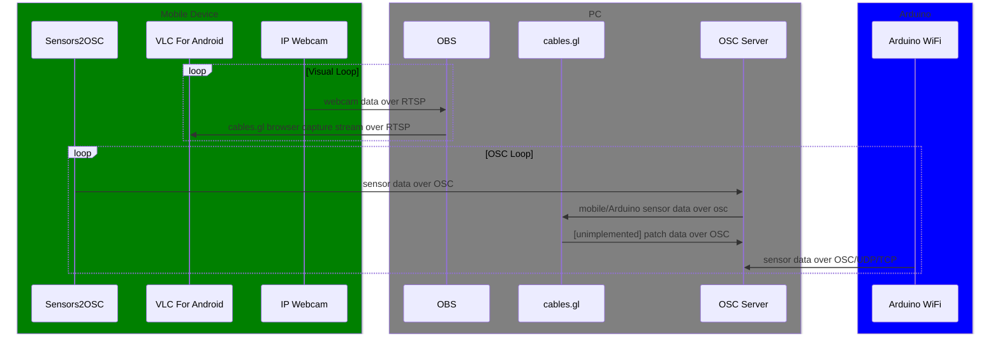

# note: this documentation of an unfinished project is currently being rewritten, so it is mostly incomplete until further notice

---
# warden_doctor
```
an interoperational visual project between arduino, espruino, node, osc, mobile, cables.gl, and [tbd]. uses arduino-based + mobile sensors sent along the OSC protocol to cables.gl and various other places for further synthesis and chaos.
```
# prerequisites
  - cables.gl/web browser
    - any modern browser that can run [cables.gl](cables.gl) will work
      - the cables patch can be exported to an electron package or even the recent standalone client beta 
        - however,  this is untested on my end, and may not work with the necessary video/osc connections running through the project
  - [currently unimplemented]Arduino/Espruino
    - mainly for tracking and sending of sensor data over OSC/UDP
      - I wanted to implement some form of more interesting/esotric sensor types alongside the mobile phone sensor data like heart-rate monitors, ultrasonic/distance-measuring, color sensors, a secondary camera system, but time constraints pushed all sensor scaffolding to only mobile device for the moment
    - A WiFi-enabled Arduino like the Arduino WiFi will work for this project
      - I have also jury-rigged an Espruino and Arduino together over Serial, using the Arduino to collect data, send said data over Serial to the Espruino, and send data over UDP packets from the Espruino using nodegram 
        - this was horrendously unstable and more or less broke if you looked at it wrong, or the cables moved, etc, but daisy-chaining microcontrollers like this might be an option if a multitude of sensors are used in the project
  - OSC Server/router
    - I used [OSCRouter](https://github.com/ETCLabs/OSCRouter) as a turnkey solution for this, but anything like [nodeosc](https://github.com/MylesBorins/node-osc) or [python-osc](https://pypi.org/project/python-osc/) can be easily set up for this
  - OBS w/ [OBS-rtspserver](https://github.com/iamscottxu/obs-rtspserver/)
    - this is used to act as a bridge for visual data from the mobile device and cables.gl
    - lol
  - mobile device with these apps: 
    - [sensors2osc](https://sensors2.org/osc/)
      - used for transmitting mobile sensor data such as gyroscope and positional data over OSC protocol to any IP address of our choice
    - [IP Webcam](https://play.google.com/store/apps/details?id=com.pas.webcam&hl=en_US)
      - used to transmit webcam data to OBS over RTSP, and in a roundabout way, cables.gl
      - any webcam app that can stream over the RTSP procotol will work, but IP Webcam is the one I kept up with throughout this project
    - [VLC For Android](https://play.google.com/store/apps/details/VLC_for_Android?id=org.videolan.vlc&hl=en_US)
      - used for receiving and viewing RTSP visual stream from OBS
    - rationale:
      - these apps in particular were chosen because they can be run in separate background processes on an Android phone without Android memory management (likely not) kicking in and putting the apps to sleep, 
        - note: having all of these apps running concurrently **will** shred your battery on lower-tier phones (in my experience), so a well-charged battery is recommended
  - [optional but nice] any Google Cardboard-like headset
    - My university had these [BNext VR Headsets](https://www.amazon.com/Headset-iPhone-Android-Phone-Comfortable/dp/B07GX7KH9Q?th=1), so I ended up testing with one of these
      - to put it bluntly, they're not great/comfortable and are more likely to make you motion-sick than anything, which would feed into the project theme well enough, but otherwise are more "attach mobile device to face by any means necessary" than anything
    - this ended up being integrated into a wearable helmet contraption for the show, but otherwise is purely for immersionary/aesthetics
  - 
  - 
# prescreening
  - Arduino
    - The libraries currently necessary for this project are:
      - SoftwareSerial
      - HCSR04
    - By default, the Serial RX/TX pins used in the project are:
      - TX: D2
      - RX: D3
    - Pinout and schematic 
  - Espruino
# How to work the magic
  Cloning this repository will have everything you need to get the ball rolling, but you may need to build from the typescript files 
#### Note: this is a semi-intensive, multi-step, multi-program process
  1. Mobile Device
     1. Sensors2Osc
     2. IP Webcam
     3. VLC For Android
  2. PC
     1. OBS
        1. 
     2. cables.gl
     3. VLC
  3. Arduino/Espruino 

# building
  a simple 

# generalized sequence diagram 
